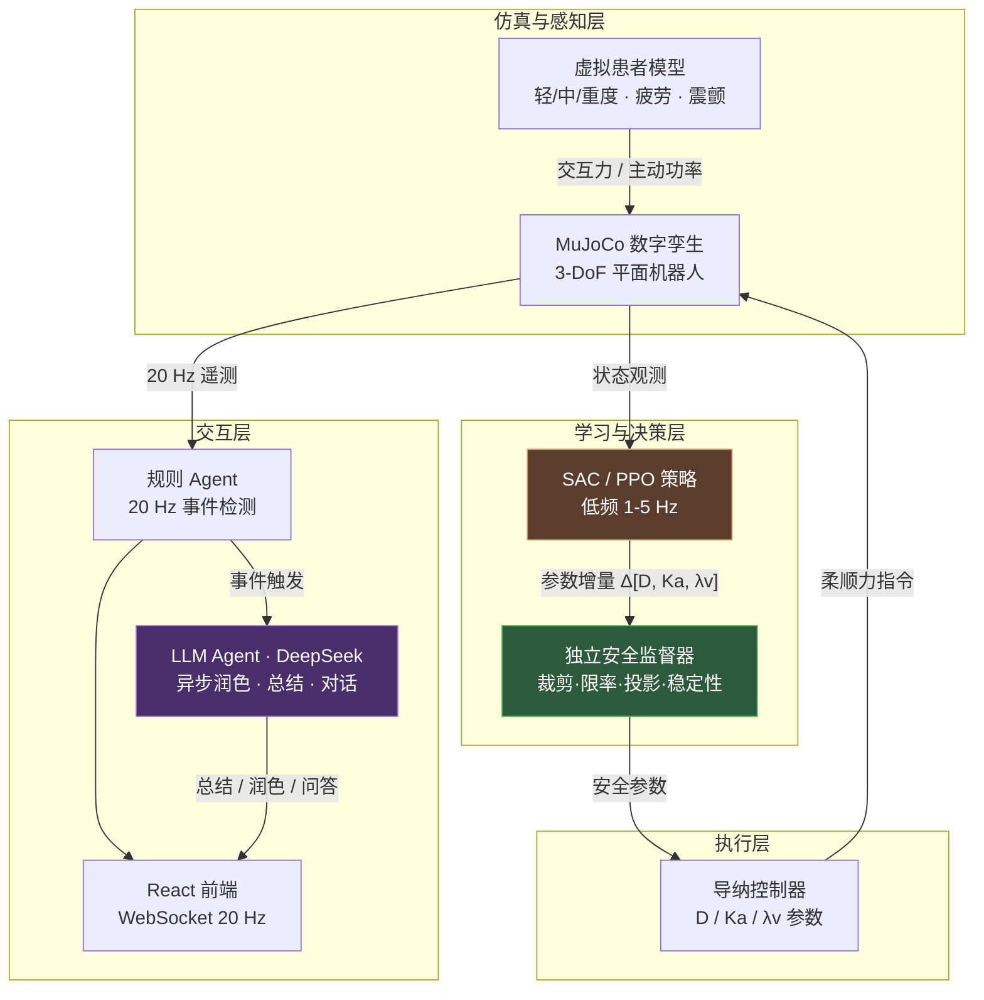
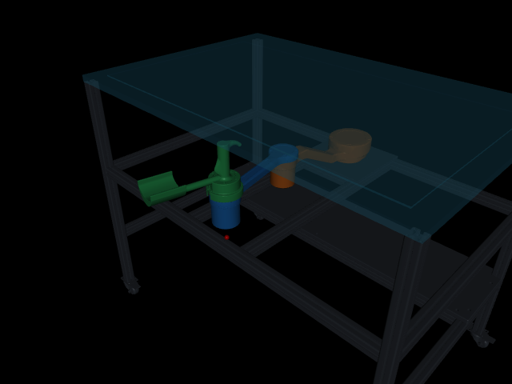
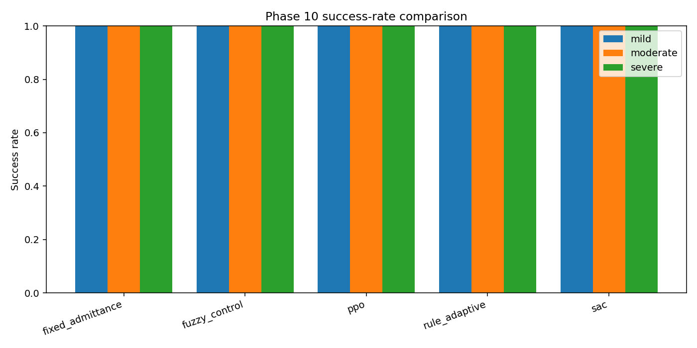
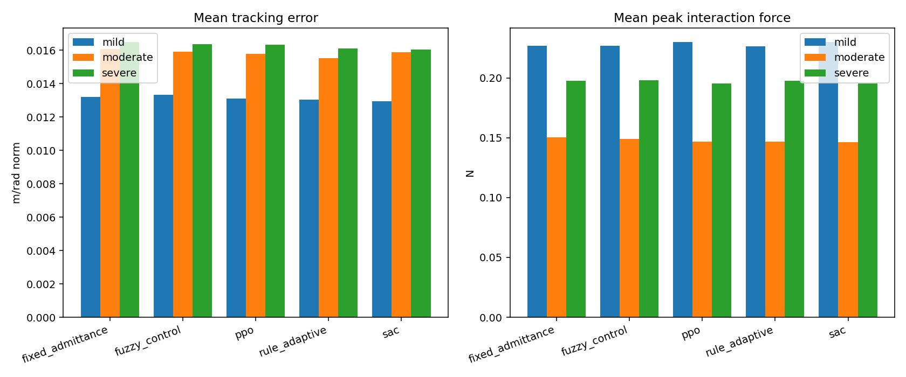
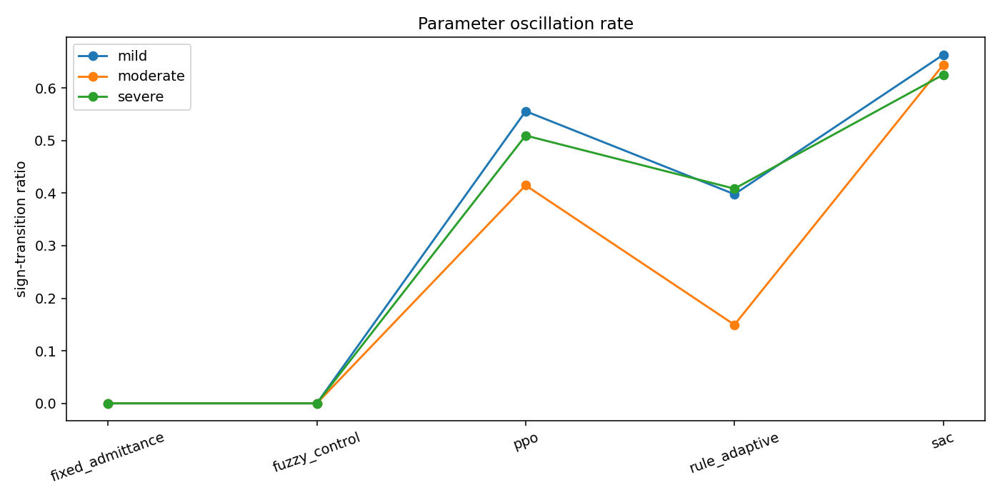
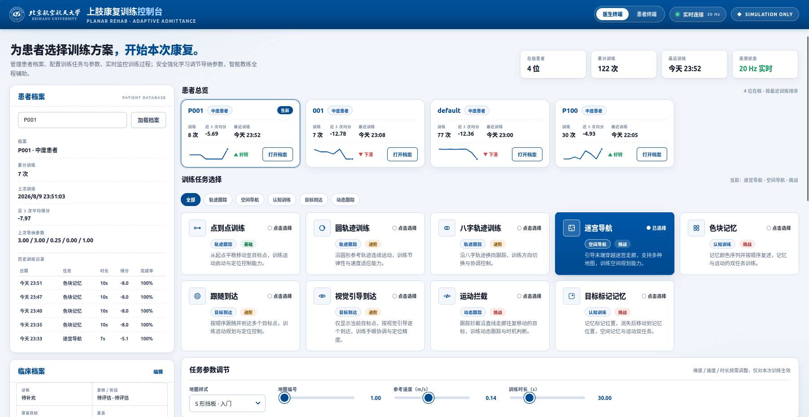
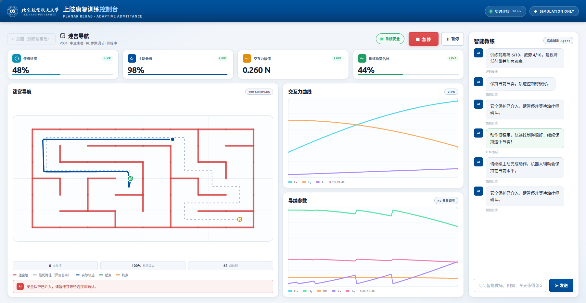
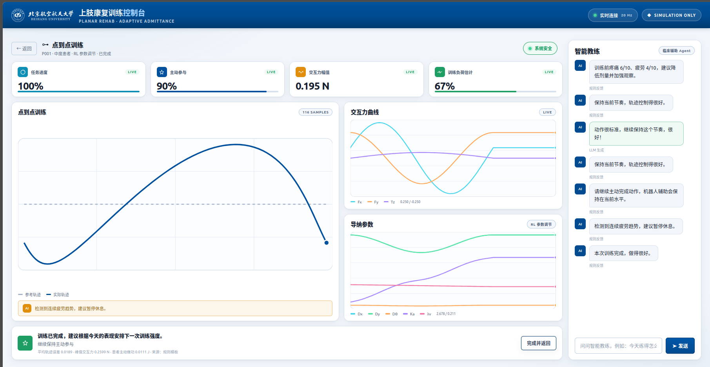
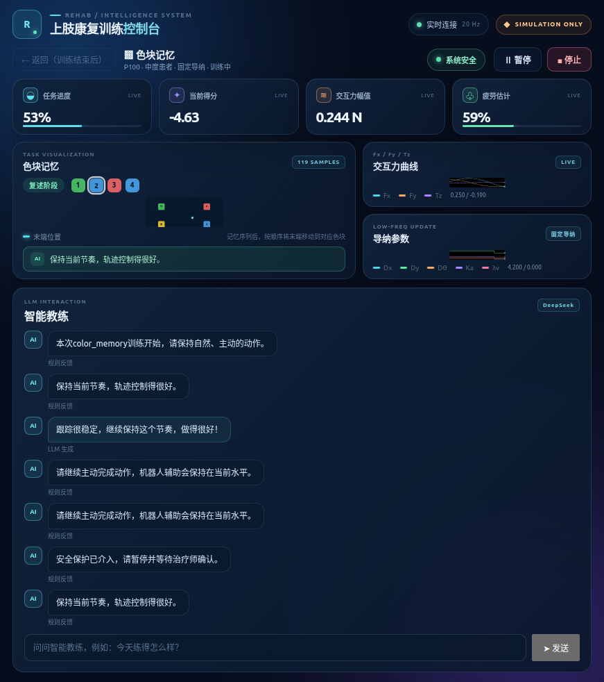
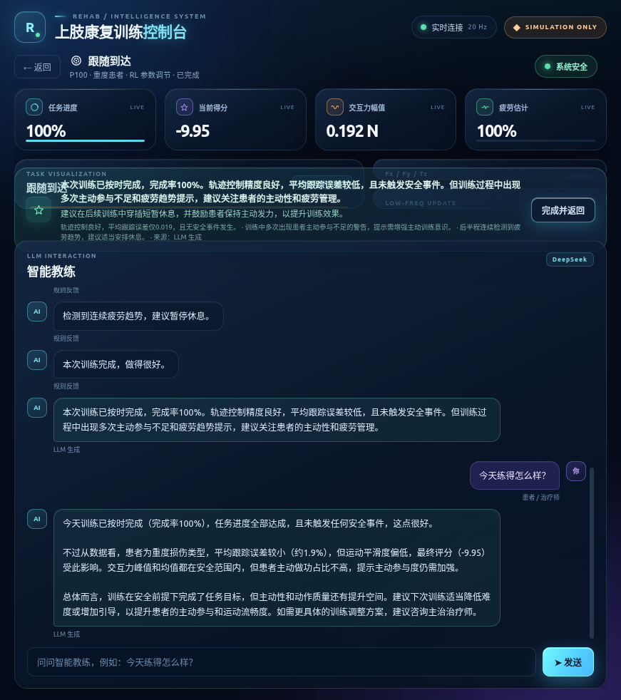

<div align="center">

# 基于强化学习与交互 Agent 的上肢康复机器人自适应导纳训练系统

** RL-Driven Adaptive Admittance Training System with an LLM Interaction Agent**


*让强化学习做"大脑"、传统控制做"小脑"、大模型做"教练"，构建安全、自适应、可对话的上肢康复训练闭环。*

</div>

---

## 一、项目背景

平面三自由度上肢康复机器人通常采用**固定参数导纳控制**：阻尼过小会导致响应振荡、放大异常扰动；阻尼过大则运动迟缓、患者主动参与度下降。而传统人工调参依赖经验，**难以连续适配不同患者、不同训练阶段，以及同一患者在疲劳前后的运动能力变化**。

本项目构建了一套 **安全强化学习（Safe RL）驱动的自适应导纳训练系统**：

- 强化学习作为"大脑"，在安全约束下**低频（1–5 Hz）在线调整导纳参数**（阻尼、辅助增益、速度限制）；
- 底层柔顺控制仍由**传统导纳控制器**执行，RL 不进入电机控制闭环；
- 引入 **LLM 交互 Agent**，实时感知训练状态，为患者提供任务引导、过程反馈与训练总结，形成 **"感知—决策—执行—反馈"** 的完整人机交互闭环。

项目覆盖 **MuJoCo 数字孪生 → 虚拟患者建模 → Gymnasium 训练环境 → SAC/PPO 策略训练 → 安全部署层 → 实时交互页面 → LLM 交互 → ROS2 真机接口** 的完整链路。

---

## 二、核心创新点

| # | 创新点 | 说明 |
|---|--------|------|
| 1 | **RL 只调参、不进环** | SAC 策略仅低频输出导纳参数增量，电机控制仍由确定性导纳控制器执行，从架构上隔离 RL 不确定性 |
| 2 | **独立安全监督器** | 裁剪 → 变化率限制 → 边界投影 → 稳定性检查四级流水线，异常/NaN/超力/掉线时**自动回退保守参数**，安全逻辑完全不依赖 RL 模型 |
| 3 | **参数化虚拟患者** | 轻/中/重度阻抗模型，模拟主动力、反应延迟、方向偏置、力噪声、周期性震颤及**基于主动功率的疲劳累积与恢复**，为训练提供可随机化、可泛化的场景 |
| 4 | **规则检测 + LLM 异步表达的分层交互 Agent** | 规则层保证 20 Hz 实时、确定性事件检测；LLM（DeepSeek）仅**异步**增强表达（事件润色 / 个性化总结 / 对话问答），失败自动回退模板，与控制环完全解耦 |
| 5 | **全链路工程化可复现** | 多随机种子、配置目录 SHA-256 哈希、Git commit 记录、`pytest`/`ruff`/`mypy` 三重验收 |

---

## 三、系统架构



> **关键设计**：RL 与 LLM 都被"关在笼子里"——RL 只输出任务空间导纳参数、LLM 只生成文本，二者均不接触电机力矩/电流/关节指令，任何异常都触发确定性回退。

---

## 四、机器人装置与数字孪生

装置为平面三自由度串联结构，任务空间 `[x, y, θ]`，人机交互力 `[Fx, Fy, Tz]`。CAD 模型经 STEP → URDF/MJCF 转换后导入 MuJoCo，三关节零位按 CAD 校正为三连杆共线。

<p align="center">
  
</p>

运动学与 MuJoCo 运行时接口：

- 正/逆运动学与 DLS IK：`rehab_sim/robot/kinematics.py`
- MuJoCo 机器人封装与外力注入：`rehab_sim/robot/mujoco_robot.py`

---

## 五、核心技术模块

### 5.1 安全强化学习自适应导纳

- **问题建模**：RL 定位为低频导纳参数调节器，动作空间为四维参数增量 `[ΔDxy, ΔDθ, ΔKa, Δλv]`；观测采用 0.5 s 滑动窗口统计特征（轨迹误差、交互力、患者主动功率、运动平滑度、疲劳估计等）。
- **奖励设计**：多分量奖励函数——任务进度、跟踪误差、过大交互力、运动突变、辅助能量、患者主动功率、成功与不安全终止。
- **训练环境**：点到点、圆轨迹、"8"字轨迹三类 Gymnasium 连续控制环境，经 SB3 `check_env` 验证，固定种子可复现。
- **算法**：SAC（`MultiInputPolicy` + `VecNormalize`）为主算法，PPO 作为对比基线。

### 5.2 独立安全部署层

策略动作依次经过 **裁剪 → 参数变化率限制 → 边界投影 → 稳定性检查**；在推理异常/超时、NaN、传感器掉线、交互力超限时自动回退到保守固定参数。训练期探索与部署期确定性推理完全解耦。

### 5.3 LLM 交互 Agent（规则检测 + LLM 异步表达）

这是本项目的**交互层创新**，采用分层设计兼顾实时性、可靠性与个性化：

```
患者训练表现（20 Hz 遥测）
        │
        ▼
规则 Agent（确定性 · 零延迟 · 免费）── 事件检测 → 规则消息 → 聊天面板
        │ 事件触发
        ▼
异步队列 + 后台 Worker ── LLM 润色事件 / 生成总结 / 回答提问（DeepSeek）
        │ 失败 · 超时 · 缺 Key
        ▼
  自动回退规则模板（用户无感知）
```

- **规则层**：识别跟踪误差过大、交互力过大、速度过快/过慢、患者不活跃、疲劳、安全停止等 8 类事件，带事件冷却与结构化审计日志；
- **LLM 层**：
  - *事件润色*——把规则消息个性化为有温度的口头反馈；
  - *训练总结*——基于训练报告与事件序列，用 JSON 结构化输出生成亮点/风险提示/下一步建议；
  - *对话问答*——患者/治疗师可随时提问，LLM 基于当前训练数据作答；
- **安全与解耦**：LLM 调用全部异步（`asyncio.Queue` + 后台 Worker），与 20 Hz 控制环完全解耦；API Key 仅从环境变量读取；任何失败返回 `None` 回退模板，**绝不阻塞或影响控制**。

### 5.4 实时交互系统与机器人接口

- **后端**：FastAPI + WebSocket 实现 20 Hz 实时遥测（参考/实际轨迹、Fx/Fy/Tz 力曲线、导纳参数、安全状态、疲劳估计、训练摘要），支持任务/患者/控制模式切换；
- **前端**：React + TypeScript + Vite 单页应用（首页任务库 + 训练页左右分栏），实时图表与智能教练聊天面板；任务库覆盖轨迹跟踪、迷宫导航与色块记忆三大类五项训练；
- **ROS2**：自定义接口消息、仿真/真机统一 `RobotAdapter` 桥接、确定性策略节点与任务管理器，支持固定参数模式独立运行与通信看门狗安全回退。

---

## 六、实验结果

以 SAC 为主算法，与 PPO、固定导纳、规则自适应、模糊控制共**五种方法**在轻/中/重度虚拟患者上对比（每条件 5 随机种子 × 5 episodes），评估成功率、安全终止率、跟踪误差、峰值交互力、患者主动做功占比、辅助能量与参数振荡率。

> **关于成功率**：五种方法均实现 100% 安全完成率——这是康复系统所有方法必须满足的安全底线。方法间的核心差异体现在质量指标上：**SAC 跟踪误差最低**（轻度 0.0129 vs 固定导纳 0.0132）且峰值交互力更低；**重度患者下模糊控制的患者主动参与度降至 0.62**（过度辅助压制了患者主动性），而 SAC/规则自适应保持在 0.83/0.87，验证了自适应辅助的价值；固定导纳参数振荡率为 0（不调参），SAC 主动调参（振荡率 0.63–0.66）但换来更优的跟踪与更低的交互力。

<p align="center">
  
  <br/><em>五方法 × 三类患者 成功率对比</em>
</p>

<p align="center">
  
  <br/><em>跟踪误差与交互力对比</em>
</p>

<p align="center">
  
  <br/><em>导纳参数稳定性 / 振荡率</em>
</p>

一键流水线自动输出逐 episode 数据、统计表、曲线、Markdown 报告与演示视频：

```bash
python3 -m scripts.run_phase10_experiments
```

---

## 七、实时交互界面

前端采用**单页双视图布局**：首页（医生终端 / 患者终端）选择训练任务与参数，点击"开始训练"后进入训练页——**左侧 2/3 展示各数据模块，右侧 1/3 为智能教练聊天框**（≤1100px 窄屏自动切换单列滚动，保证全部图表可达）。

任务库覆盖五类九项训练：**轨迹跟踪**（点到点 / 圆轨迹 / 八字）、**空间导航**（迷宫导航）、**目标到达**（跟随到达 / 视觉引导到达）、**动态跟踪**（运动拦截）、**认知训练**（色块记忆 / 目标标记记忆）。

<p align="center">
  
  <br/><em>首页：双栏医生工作台 · 任务库 · 患者档案 · 训练方案</em>
</p>

<p align="center">
  
  <br/><em>迷宫导航训练页：迷宫可视化 · 交互力曲线 · 导纳参数（左 2/3）+ 智能教练（右 1/3）</em>
</p>

<p align="center">
  
  <br/><em>跟随到达训练页：按顺序跟随并到达多个目标点 · 轨迹与目标点可视化</em>
</p>

<p align="center">
  
  <br/><em>色块记忆训练页：记忆/复述阶段 · 颜色序列 · 四色块工作区</em>
</p>

训练结束后，LLM 自动生成个性化总结并写入聊天流，患者/治疗师可随时提问：

<p align="center">
  
  <br/><em>智能教练聊天流：规则反馈 + LLM 生成的个性化训练总结</em>
</p>

---

## 八、项目结构

```
rl_admittance_rehab_ws/
├── assets/mujoco/            # MJCF 数字孪生与 mesh 资产
├── configs/                  # YAML 配置体系（机器人/导纳/安全/Agent/RL/ROS2）
├── rehab_sim/                # 核心仿真与控制库
│   ├── robot/                #   运动学、MuJoCo 机器人
│   ├── controllers/          #   任务空间导纳控制器
│   ├── patients/             #   虚拟患者与疲劳模型
│   ├── envs/                 #   Gymnasium 训练环境
│   ├── rewards/              #   多分量奖励函数
│   ├── safety/               #   独立安全监督器
│   ├── agent/                #   规则 Agent + LLM Agent
│   ├── rl/                   #   SAC/PPO 训练与评估
│   └── tasks/                #   参考轨迹（点到点/圆/8字）
├── backend/                  # FastAPI + WebSocket 后端
├── frontend/                 # React + TypeScript + Vite 前端
├── ros2_ws/src/              # ROS2 接口、策略节点、任务管理器
├── scripts/                  # 训练/评估/实验一键脚本
├── experiments/              # 实验数据、模型与报告
├── tests/                    # unit / integration / regression
├── screenshots/              # README 界面与实验截图（公开）
└── docs/                     # 内部文档与学习资料（不推送）
```

---

## 九、快速开始

### 环境要求

- Python 3.10+
- Node.js 18+（前端）
- 可选：ROS2 Humble（真机接口）

### 安装

```bash
cd rl_admittance_rehab_ws
python3 -m venv .venv && source .venv/bin/activate
python3 -m pip install -r requirements.txt
python3 -m pip install -e .
```

### 配置 LLM（可选）

```bash
cp .env.example .env      # 填入你的 DeepSeek API Key
```

> 不配置 Key 时，系统自动回退为纯规则交互模式，其余功能不受影响。启用/关闭 LLM 见 `configs/agent.yaml` 中 `agent.llm.enabled`。

### 启动实时交互页面

```bash
# 终端 1：后端（端口 8000）
python3 -m uvicorn backend.app.main:app --port 8000

# 终端 2：前端（端口 5173）
cd frontend && npm install && npm run dev
```

浏览器打开 `http://localhost:5173`，配置任务/患者/模式后点击"开始训练"。

### 训练与实验

```bash
python3 -m scripts.train_sac                # 训练 SAC
python3 -m scripts.run_phase10_experiments  # 五方法对比实验
python3 -m scripts.run_phase1_sim --top     # MuJoCo 可视化
```

---

## 十、测试与工程化

```bash
PYTEST_DISABLE_PLUGIN_AUTOLOAD=1 pytest     # 单元 + 集成 + 回归
ruff check .                                # 代码检查
mypy rehab_sim backend                      # 类型检查
```

- **可复现性**：每个 episode 使用显式随机种子；输出记录配置目录 SHA-256 与 Git commit；SAC/PPO 保存模型与 `VecNormalize` 统计；`--quick` 支持新环境短周期端到端验证。
- **测试覆盖**：LLM 层使用 mock HTTP 传输测试（不依赖外部 API），覆盖成功解析、JSON 容错、超时/失败回退、冷却与禁用路径。

---

## 十一、安全边界与限制

> ⚠️ 强化学习与对比策略**不直接输出电机力矩、电流或关节命令**。真实机器人接入仍需经过驱动器、机械限位、急停、力矩/速度阈值、零力校准与无人体台架测试。虚拟患者指标是仿真代理量，不能直接解释为临床结论。本项目结果为仿真/开发对比，不替代真实机器人与人体验证。

---

## 许可证

本项目采用 [MIT License](LICENSE)。
